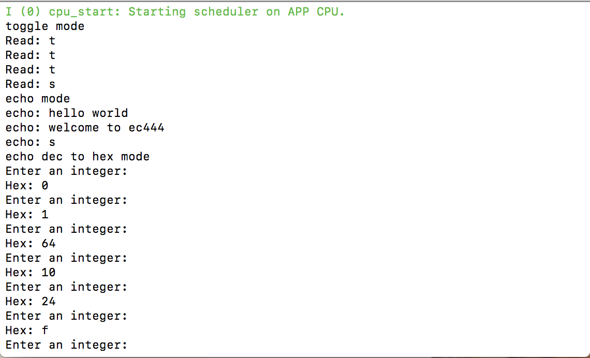

#  Skill Name: Console I/O

Author: Chen-Yu Chang

Date: 2020-09-12
-----

## Summary
1. I built a directory (console_i/o) to put all the codes, CMakeList.txt, Makefile.
2. I altered the text of CMakeList.txt to contain the right project.
3. I wrote a console_i_o.c that is in the code folder.
4. I configured and build the project and I can successfully switch the three modes.

## Sketches and Photos

## Modules, Tools, Source Used Including Attribution
C Language, Xcode, Terminal

## Supporting Artifacts
Uart: https://docs.espressif.com/projects/esp-idf/en/latest/esp32/api-reference/peripherals/uart.html

Standard I/O Streams: https://docs.espressif.com/projects/esp-idf/en/latest/esp32/api-reference/storage/vfs.html#standard-io-streams-stdin-stdout-stderr

-----
