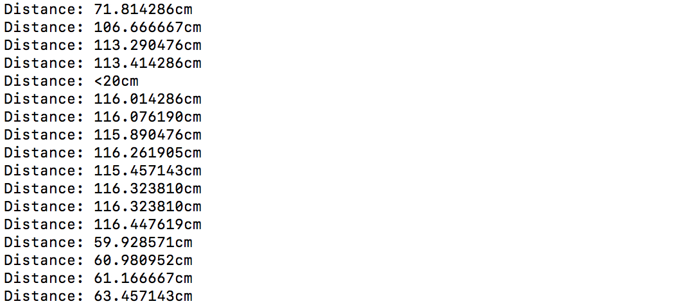

#  Skill Name: Long Range IR Range Sensor

Author: Chen-Yu Chang

Date: 2020-10-06
-----

## Summary
1. I built a directory (rangefinder) to put all the codes, CMakeList.txt, Makefile...
2. I altered the text of CMakeList.txt to contain the right project.
3. I wrote a thermistor.c file that are in the code folder.
4. I configured and build the project and I can successfully use an IR source to reflect off of an object to measure distance at a receiver mounted on the same unit. It displays the results on the console, sampled every 2s.

## Sketches and Photos

## Modules, Tools, Source Used Including Attribution
Software: Atom, GitHub, Xcode(C Language), Terminal

Hardware: Alphanumeric Display, ESP32, Wires, IR Range Finder

## Supporting Artifacts

ADC Control:

https://docs.espressif.com/projects/esp-idf/en/latest/esp32/api-reference/peripherals/adc.html

ADC Example Code:

https://github.com/espressif/esp-idf/tree/39f090a4f1dee4e325f8109d880bf3627034d839/examples/peripherals/adc

Sharp IR Rangefinder:

https://www.sparkfun.com/datasheets/Sensors/Infrared/gp2y0a02yk_e.pdf

-----

Thermistor Video

