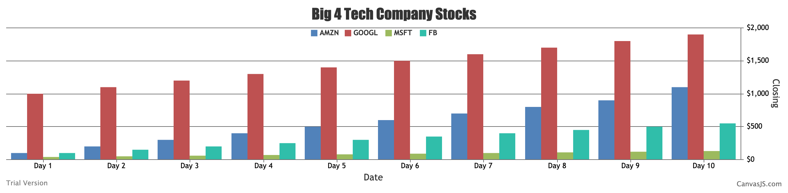

#  Skill Name: CanvasJS

Author: Chen-Yu Chang

Date: 2020-10-06
-----

## Summary
1. I read the examples in CanvasJS, learning the basic implementations of how to code a correct graph that I want.
2. I created a graph based on the data given in stocks-csv.txt.
3. I wrote another code, app.js, to take the file as input and plot the graph showing in local:4000. The graph is the 4 big tech companies' 10 days of closing price. I plot it separated from day1 to day10.

## Sketches and Photos

## Modules, Tools, Source Used Including Attribution

Atom, GitHub, Xcode(C Language), Terminal, app.js, CanvasJS

## Supporting Artifacts

Creating Charts from CSV:

https://canvasjs.com/docs/charts/how-to/create-charts-from-csv/

CanvasJS:

https://canvasjs.com/javascript-charts/

https://canvasjs.com/javascript-charts/stacked-column-chart/

-----
