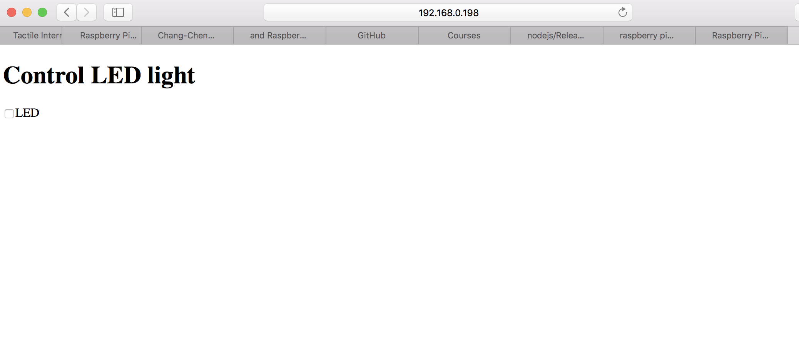

#  Skill Name: Raspberry Pi

Author: Chen-Yu Chang

Date: 2020-10-08
-----

## Summary
1. I first install the raspberry pi imager and formatted my SD card.
2. Then, I plug it back to the raspberry pi and connect to power.
3. I touched two files, ssh and wpa_supplicant.conf to connect to the wifi.
4. Using the IP address, I was able to use the raspberry pi system and do node js commands after installing node js into raspberry pi.

## Sketches and Photos

## Modules, Tools, Source Used Including Attribution
Software: Terminal, Github, Atom, Raspbian

Hardware: Raspberry pi zero W, SD card, MicroSD adapter

## Supporting Artifacts

SSH:

https://www.raspberrypi.org/documentation/remote-access/ssh/

Node js:

https://www.w3schools.com/nodejs/nodejs_raspberrypi_gpio_intro.asp

Operating System:

https://www.raspberrypi.org/documentation/installation/installing-images/README.md

https://www.raspberrypi.org/downloads/

-----
