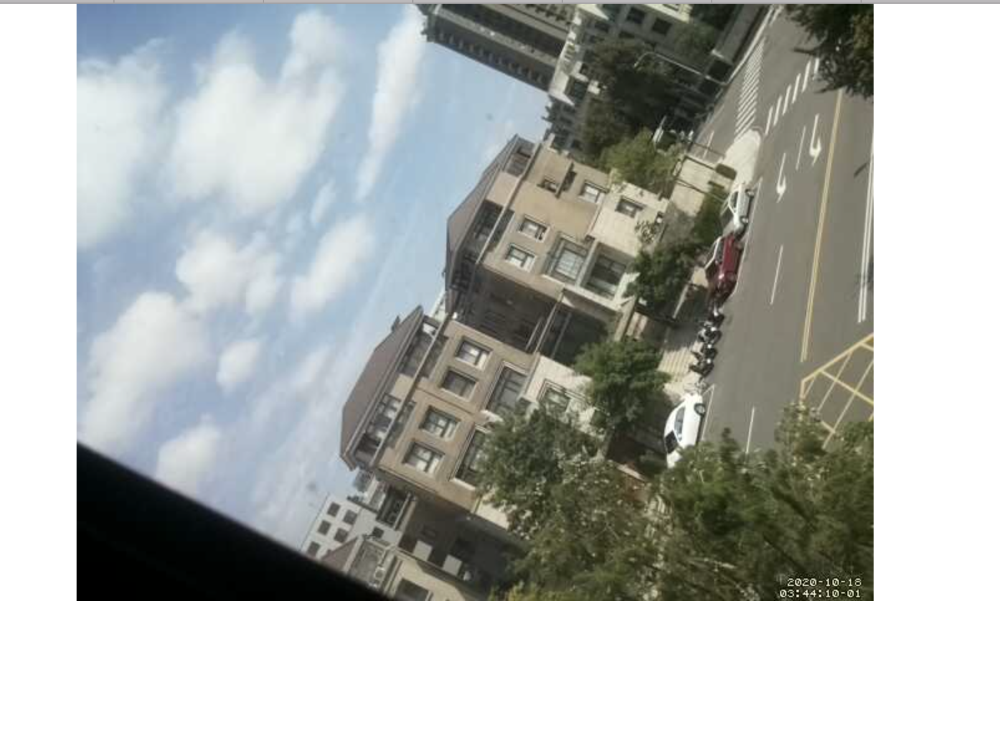

#  Skill Name: Web Camera on the Pi Zero

Author: Chen-Yu Chang

Date: 2020-10-18
-----

## Summary
1. I followed the tutorial below, and installed everything I need.
2. I turned on the setting for camera, using sudo raspi-config.
3. I changed the content of text files and the config file.
4. The output of the camera can be displayed in the ip address with 8081.

## Sketches and Photos

## Modules, Tools, Source Used Including Attribution
Raspberri Pi Zero W, Atom, Terminal, Camera Board v2

## Supporting Artifacts

Camera Setting Tutorial:

https://www.hackster.io/narender-singh/portable-video-streaming-camera-with-raspberry-pi-zero-w-dc22fd

Camera Configuration:

https://www.raspberrypi.org/forums/viewtopic.php?t=174375

-----
