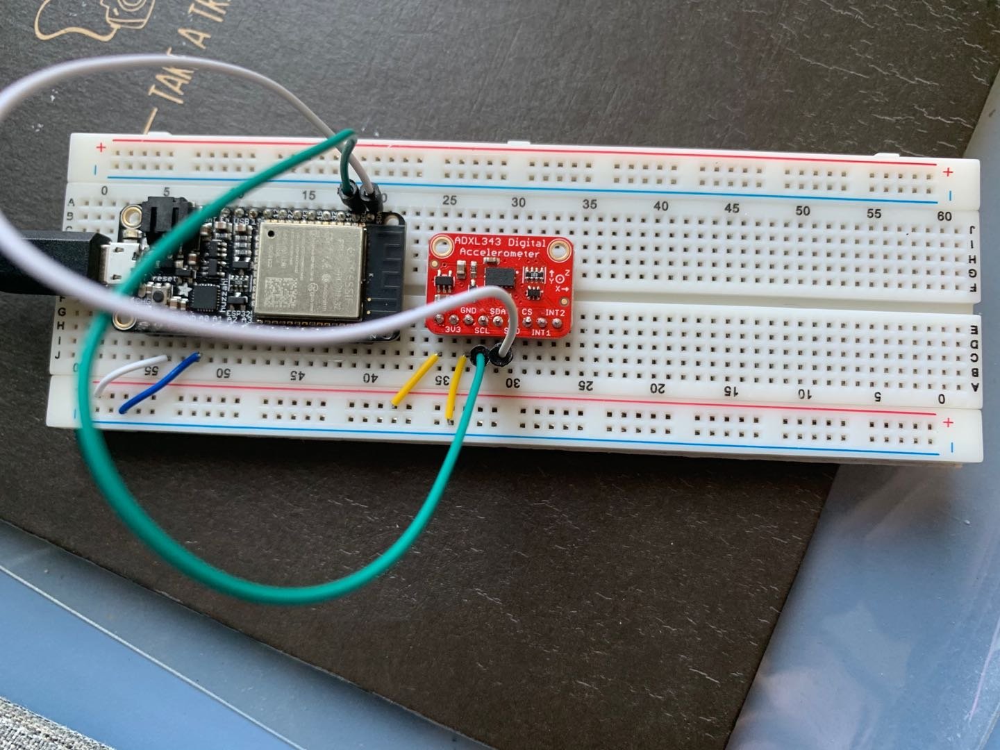
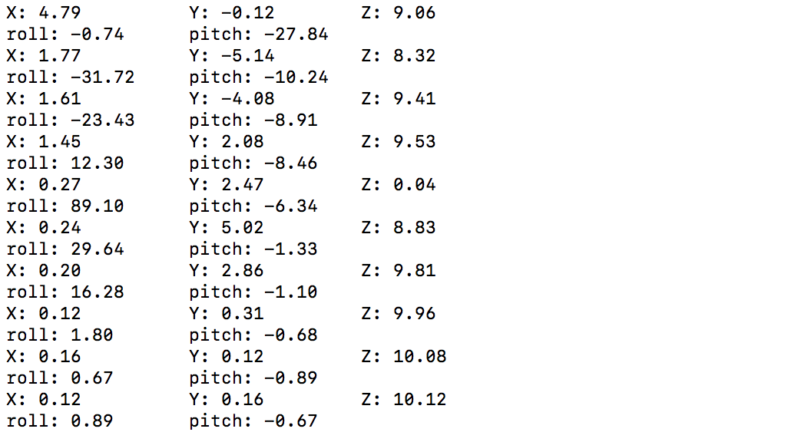

#  Skill Name: Accelerometer

Author: Chen-Yu Chang

Date: 2020-10-19
-----

## Summary
1. I built a directory (accelerometer) to put all the codes, CMakeList.txt, Makefile.
2. I altered the text of CMakeList.txt to contain the right project.
3. I wrote an accelerometer.c that is in the code folder.
4. I configured and build the project and I can successfully display the data on the terminal with all all three axes and record motion and tilt.

## Sketches and Photos

## Modules, Tools, Source Used Including Attribution
ADXL343 Accelerometer, ESP32, Terminal, C Language, Atom

## Supporting Artifacts

Base Example Code:

https://github.com/BU-EC444/code-examples/tree/master/i2c-accel

Adafruit Example Code:

https://github.com/adafruit/Adafruit_ADXL343

I2C Driver:

https://docs.espressif.com/projects/esp-idf/en/latest/esp32/api-reference/peripherals/i2c.html

ADXL343 Learning Guide:

https://learn.adafruit.com/adxl343-breakout-learning-guide/overview

-----

Accelerometer Video

