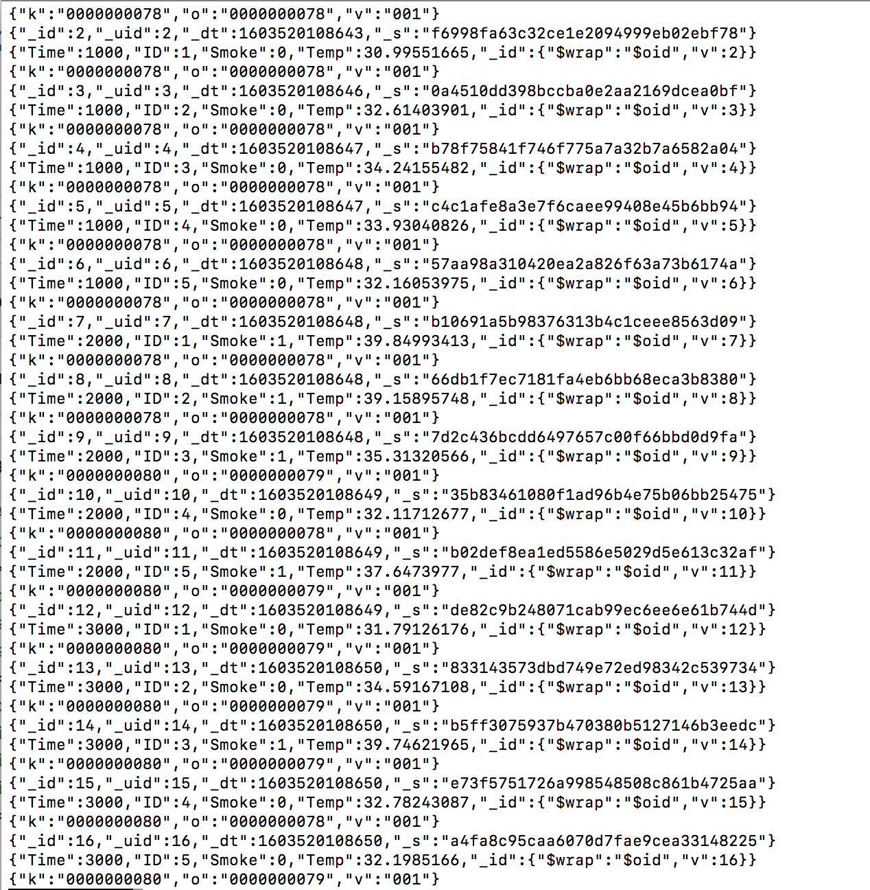
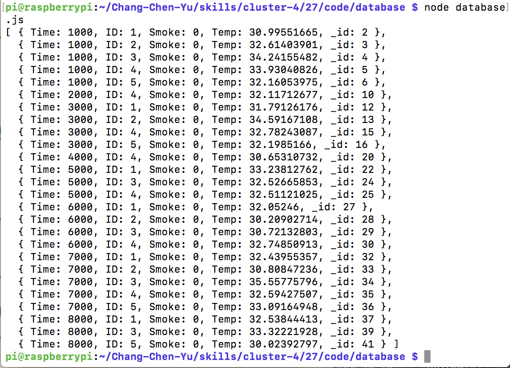

#  Skill Name: Persistence and Databases

Author: Chen-Yu Chang

Date: 2020-10-31
-----

## Summary
1. I installed MongoDB to bring up node and the db on your laptop.
2. I used smoke.txt as the data source and wrote into db.
3. In the raspberry pi, I can demonstrate a query to the database to retrieve sensor IDs with smoke and their temperature.

## Sketches and Photos

## Modules, Tools, Source Used Including Attribution
Node js, MongoDB, Terminal, Raspberry Pi, Atom, Smoke.txt

## Supporting Artifacts

Node js & MongoDB:

https://www.w3schools.com/nodejs/nodejs_mongodb.asp

MongoDB:

https://www.mongodb.com

-----
