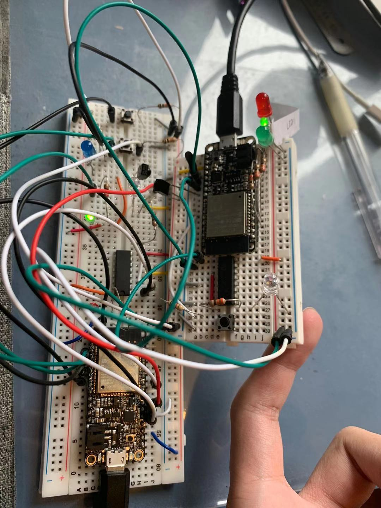
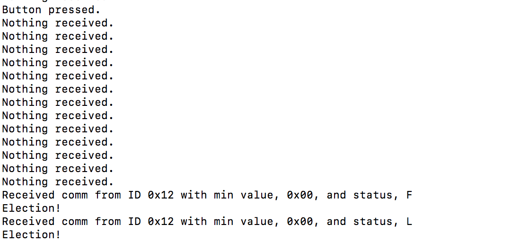

#  Skill Name: Leader Election

Author: Chen-Yu Chang

Date: 2020-11-13
-----

## Summary
I have two units available. I learned how to communicate messages using UDP between any two ESP32s on a WiFi network. These properties of leader election are summarized as: Elect exactly one leader, everyone becomes aware of the leader, and if the leader fails, a new leader election is initiated. 

## Sketches and Photos

## Modules, Tools, Source Used Including Attribution

ESP32, LEDs, Uart, Button, IR LED, Receiver, C Language, Atom, Terminal

## Supporting Artifacts

IR Example Code:

https://github.com/espressif/esp-idf/blob/master/examples/peripherals/uart/uart_echo/main/uart_echo_example_main.c

RMT:

https://docs.espressif.com/projects/esp-idf/en/latest/esp32/api-reference/peripherals/rmt.html

IR Communication:

http://whizzer.bu.edu/briefs/design-patterns/dp-irtxrx

-----
