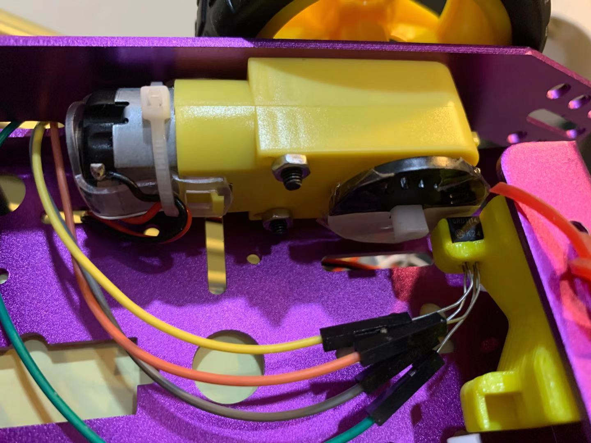

#  Skill Name: Wheel and Car Speed Sensor

Author: Chen-Yu Chang

Date: 2020-11-24
-----

## Summary
1. I assembled the purple car with motors and wheels.
2. I wired up the circuit and connected with the purple car. I also attached the optical detector beside the wheels, which is covered half with white paper and half with black.
3. I wrote the c code that makes the optical detector to detect how fast the wheel is spinning. It uses pwm modulation to power IR LED, and uses adc to read raw adc reading of phototransistor. In the code, I calculate the speed by using distance dividing time.

## Sketches and Photos

## Modules, Tools, Source Used Including Attribution

ESP32, TT Motor, Purple Car, Wheel Encoder, Optical Detector, C Code, Atom, Terminal, L298

## Supporting Artifacts

Wheel and Car Speed Sensor:

http://whizzer.bu.edu/skills/wheel-speed-tt

Pulse Counter:

https://docs.espressif.com/projects/esp-idf/en/latest/esp32/api-reference/peripherals/pcnt.html

Timer:

https://docs.espressif.com/projects/esp-idf/en/latest/esp32/api-reference/peripherals/timer.html

Pulse Counter Example Code:

https://github.com/espressif/esp-idf/tree/master/examples/peripherals/pcnt

Optical Detector:

https://learn.sparkfun.com/tutorials/qrd1114-optical-detector-hookup-guide#example-circuit

-----
