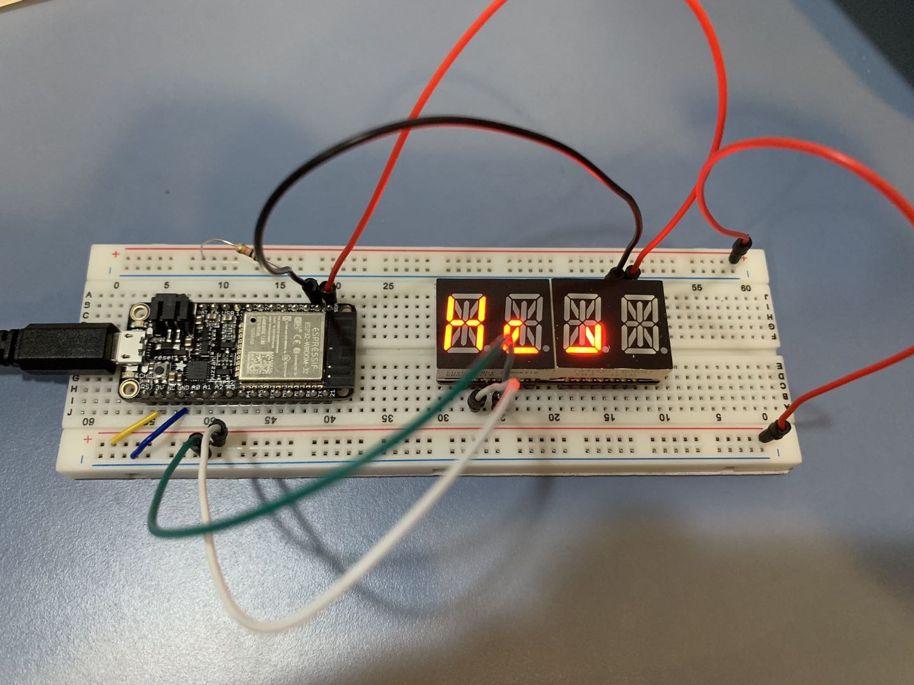

#  Skill Name: Alphanumeric Display

Author: Chen-Yu Chang

Date: 2020-09-13
-----

## Summary
1. I built a directory (alpha-display) to put all the codes, CMakeList.txt, Makefile...
2. I altered the text of CMakeList.txt to contain the right project.
3. I wrote a alpha_display.c that is in the code folder.
4. I configured and build the project and I can successfully type the string and show it on the Alphanumeric LED.

## Sketches and Photos

## Modules, Tools, Source Used Including Attribution
C(Xcode), Terminal, Github

ESP32, Adafruit 14-Segment Alphanumeric LED, Resistor

## Supporting Artifacts
Pinouts:
https://learn.adafruit.com/14-segment-alpha-numeric-led-featherwing/pinouts

Example code:
https://github.com/BU-EC444/code-examples/blob/master/i2c-display/main/i2c_display.c

Bitmap example head file:
https://github.com/adafruit/Adafruit_LED_Backpack/blob/master/Adafruit_LEDBackpack.cpp

-----

Alphanumeric LED Video

