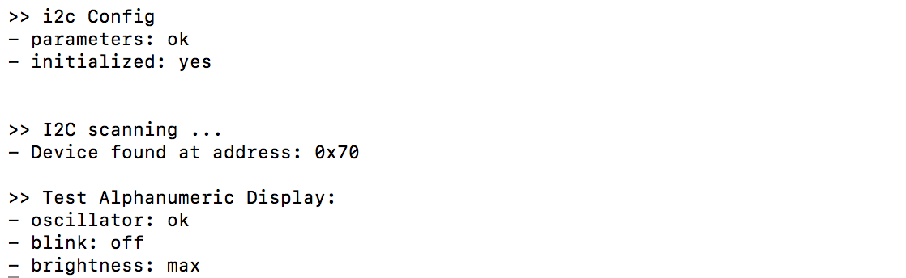
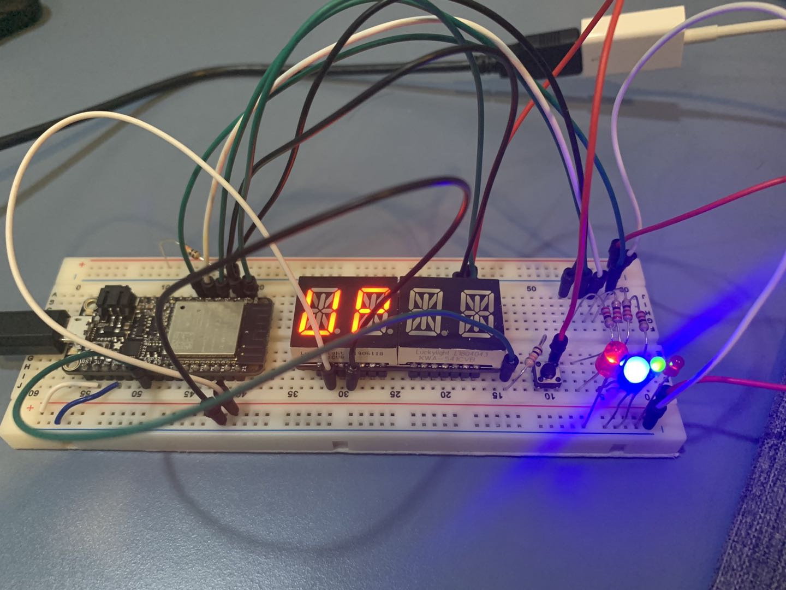

#  Skill Name: RTOS TASKs

Author: Chen-Yu Chang

Date: 2020-09-17
-----

## Summary
1. I built a directory (rtos) to put all the codes, CMakeList.txt, Makefile...
2. I altered the text of CMakeList.txt to contain the right project.
3. I wrote a rtos.c that is in the code folder.
4. I configured and build the project and I can successfully displays "UP" and "DOWN" on the alphanumeric display, and changes directions when button is pressed, using GPIO and LEDs.

## Sketches and Photos

## Modules, Tools, Source Used Including Attribution
Terminal, Atom, GitHub, Xcode(C Language)

LEDs, Resistors, ESP32, Adafruit 14-Segment Alphanumeric LED

## Supporting Artifacts
RTOS Tutorial:

https://www.freertos.org/a00125.html

https://www.freertos.org/tutorial/

https://docs.espressif.com/projects/esp-idf/en/latest/esp32/api-reference/system/freertos.html

-----

RTOS Video

