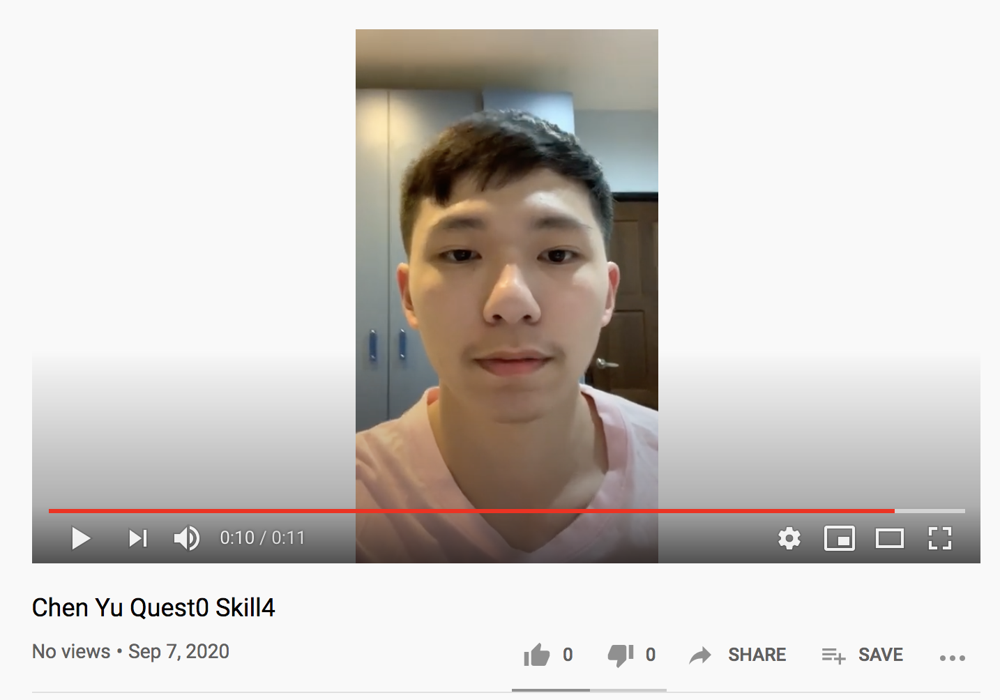
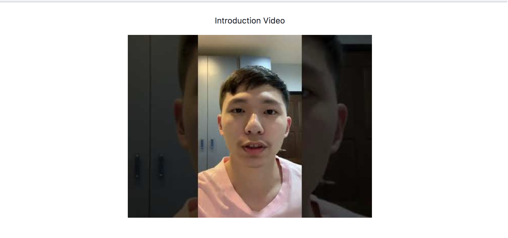

#  Skill Name : Uploading Video to Cloud

Author: Chen-Yu Chang

Date: 2020-09-06
-----

## Summary
1. I recorded a video and uploaded to youtube in public.
2. I put a photo that links to the youtube video after you press it

## Sketches and Photos
The photos are in the image folder.

## Modules, Tools, Source Used Including Attribution
HTML Embedding skills, Atom, Youtube,

## Supporting Artifacts
https://www.w3schools.com/html/html_youtube.asp

-----

Introduction Video

