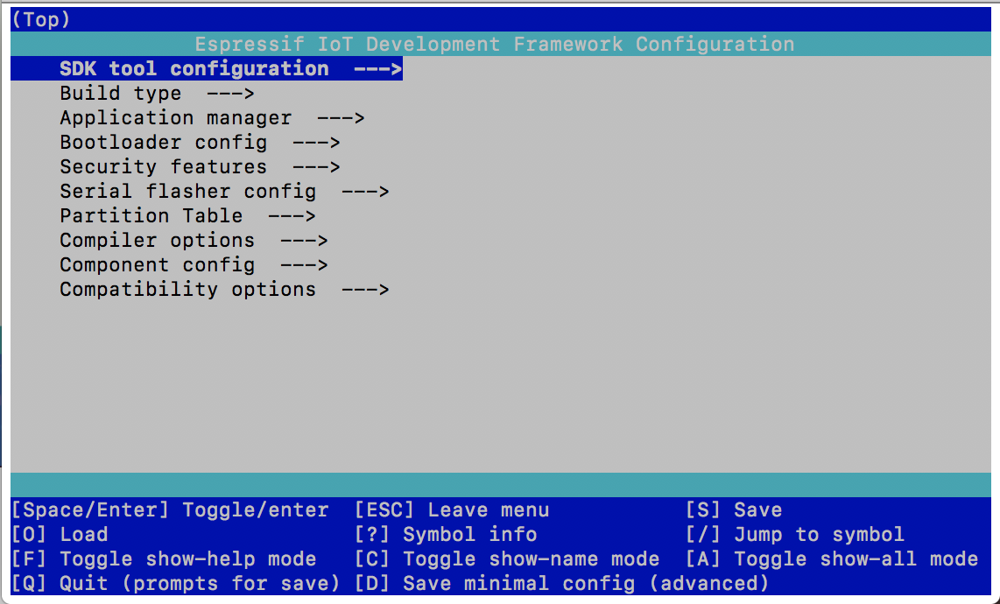
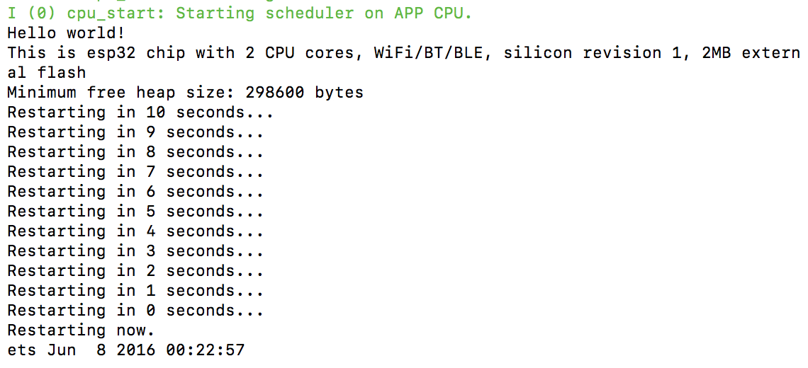
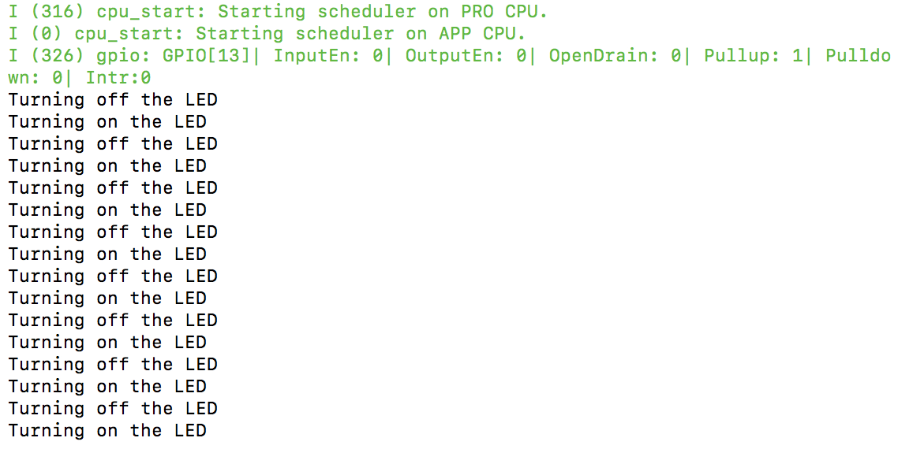
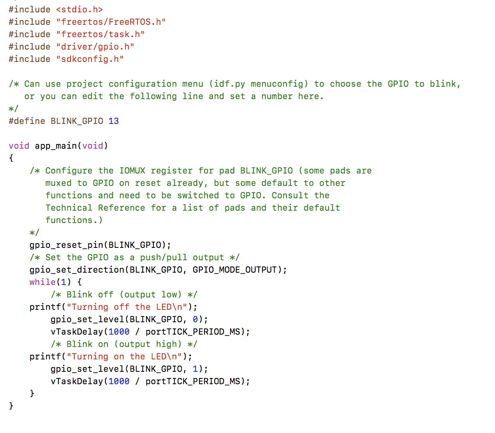

#  Skill Name : Setup Espressif Toolchain

Author: Chen-Yu Chang

Date: 2020-09-07
-----

## Summary
1. I followed the instruction and set up the toolchain.
2. I set the environment variables and path, then configured and build a project.
3. I successfully run the hello_world and flash.
4. I used terminal and altered the program that flashes the LED on pin 13.
5. I screenshot my work and recorded a video of the LED.

## Sketches and Photos
Photos are in the image folder.

## Modules, Tools, Source Used Including Attribution
Terminal

## Supporting Artifacts
https://docs.espressif.com/projects/esp-idf/en/latest/esp32/get-started/index.html

-----

Blink Video

