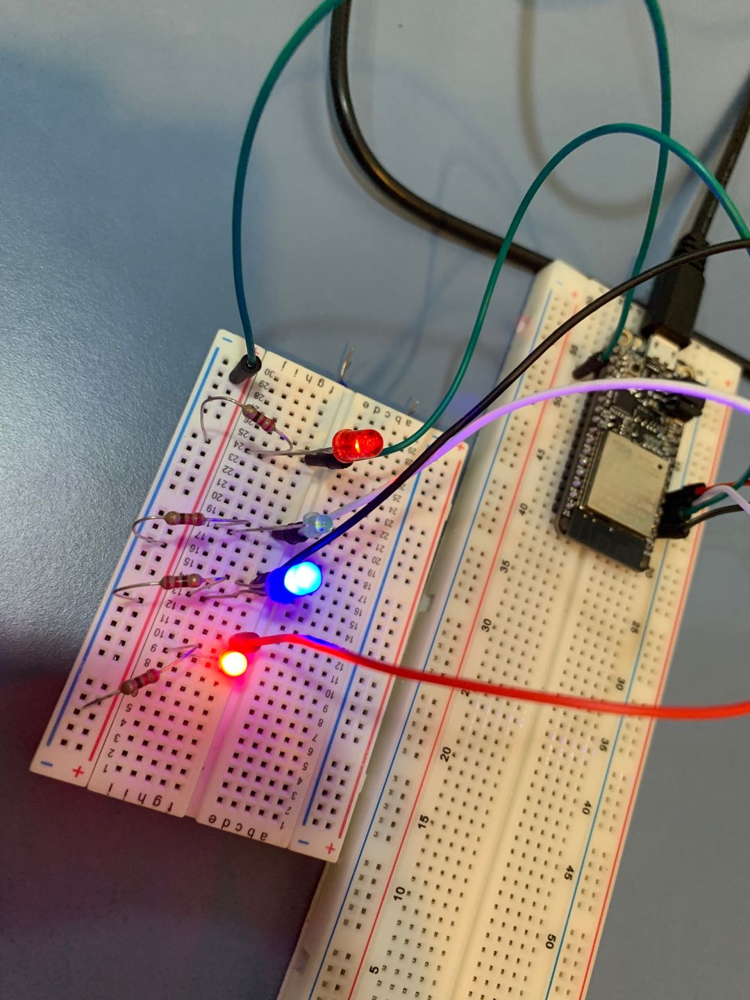

#  Skill Name: Use GPIO to Drive LEDs

Author: Chen-Yu Chang

Date: 2020-09-12
-----

## Summary
1. I built a directory (GPIO) to put all the codes, CMakeList.txt, Makefile...
2. I altered the text of CMakeList.txt to contain the right project.
3. I wrote a gpio.c that is in the code folder.
4. I configured and build the project and I can successfully flash the LEDs in a regular pattern.

## Sketches and Photos

## Modules, Tools, Source Used Including Attribution
Xcode(C Program), Terminal

4 LEDs, ESP32, 4 220ohms resistors, Breadboard

## Supporting Artifacts
The example codes that the professor provides

-----

LED Video

