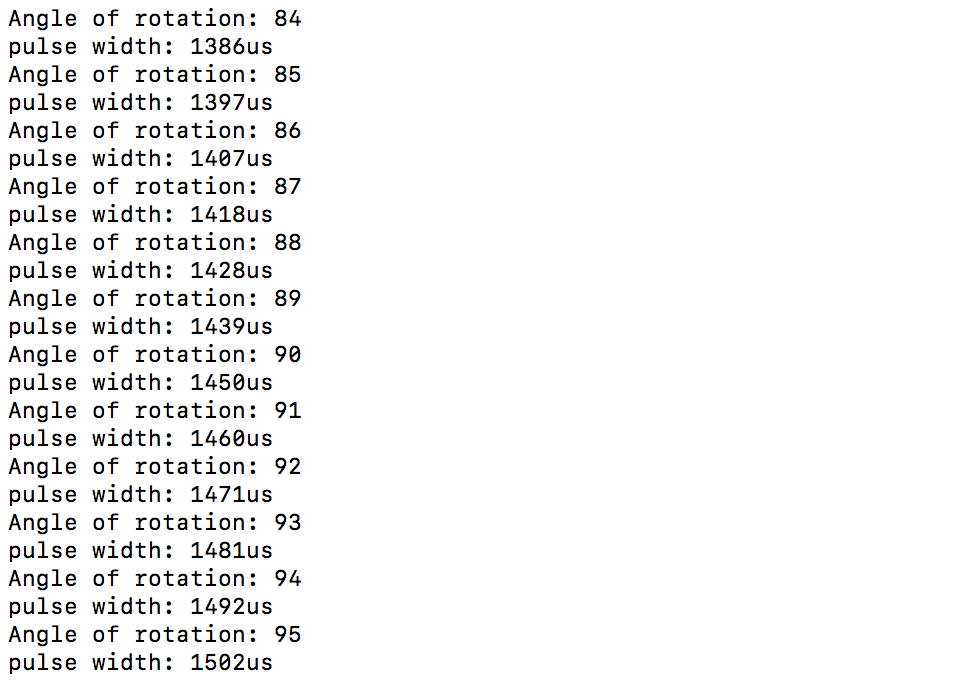

#  Skill Name: Servos

Author: Chen-Yu Chang

Date: 2020-09-16
-----

## Summary
1. I built a directory (servos) to put all the codes, CMakeList.txt, Makefile...
2. I altered the text of CMakeList.txt to contain the right project.
3. I wrote a servos.c that is in the code folder.
4. I configured and build the project and I can successfully make the servo to spin in the whole range of motion, determined by PWM.

## Sketches and Photos

## Modules, Tools, Source Used Including Attribution
C(Xcode), Terminal, Github, Atom

ESP32, Micro Servo

## Supporting Artifacts

ESP Example Code:

https://github.com/espressif/esp-idf/tree/master/examples/peripherals/mcpwm/

MCPMW:

https://docs.espressif.com/projects/esp-idf/en/latest/esp32/api-reference/peripherals/mcpwm.html

Servo Control Code:

https://github.com/espressif/esp-idf/tree/master/examples/peripherals/mcpwm/mcpwm_servo_control

-----

Servo Experiment Video

