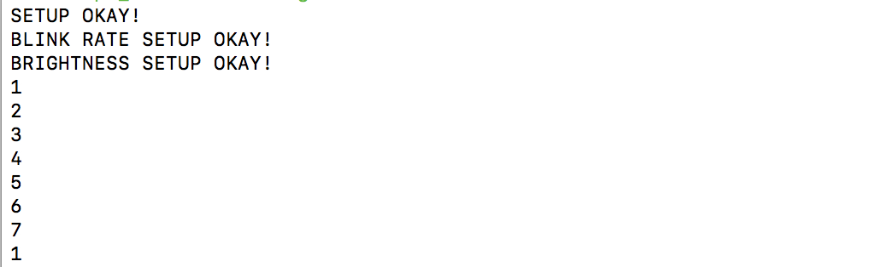
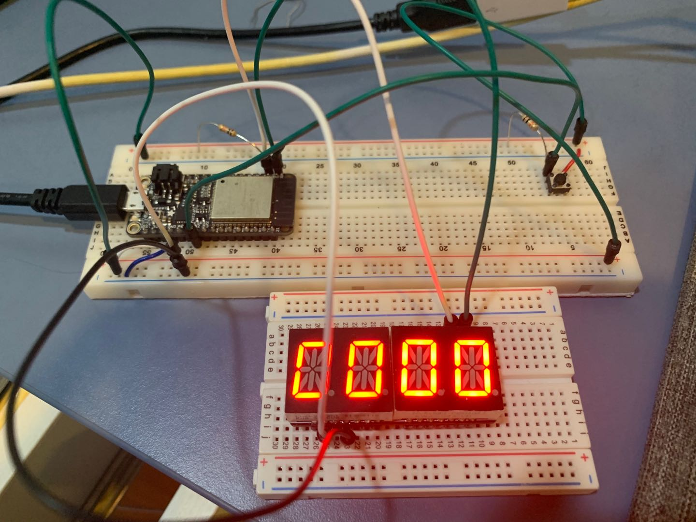

#  Skill Name: Building a Stopwatch

Author: Chen-Yu Chang

Date: 2020-09-18
-----

## Summary
1. I built a directory (timer) to put all the codes, CMakeList.txt, Makefile...
2. I altered the text of CMakeList.txt to contain the right project.
3. I wrote a timer.c and alpha_display that are in the code folder.
4. I configured and build the project and I can successfully count seconds using ESP32 and alphanumeric display. When pressed once, it starts counting. The second time you press, it stops. The third time you press, it resets the timer.

## Sketches and Photos

## Modules, Tools, Source Used Including Attribution

Terminal, Atom, GitHub, Xcode(C Language)

Resistors, ESP32, Adafruit 14-Segment Alphanumeric LED, Push button

## Supporting Artifacts

Wire.h Code:

https://github.com/esp8266/Arduino/blob/master/libraries/Wire/Wire.h

I2C Adafruit_LEDBackpack:

https://github.com/adafruit/Adafruit_LED_Backpack/blob/master/Adafruit_LEDBackpack.cpp

Timer Example Code:

https://github.com/BU-EC444/code-examples/blob/master/timer-example/main/timer-example.c

Timer Tutorial:

https://docs.espressif.com/projects/esp-idf/en/latest/esp32/api-reference/peripherals/timer.html

-----

Stopwatch Video

