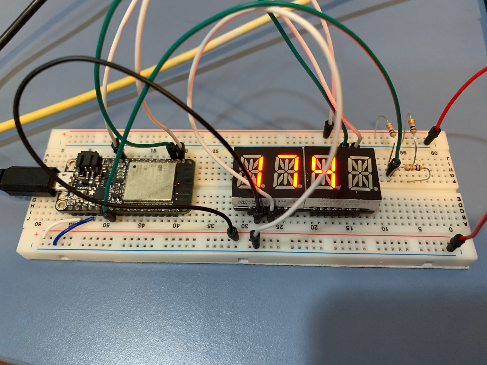
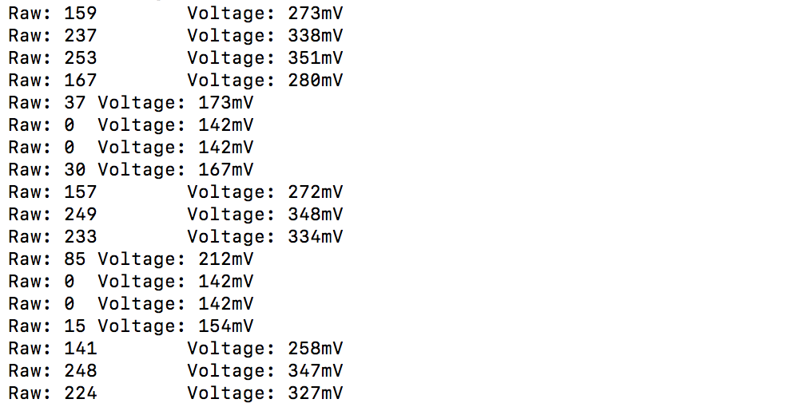

#  Skill Name: Battery Voltage Monitor

Author: Chen-Yu Chang

Date: 2020-09-29
-----

## Summary
1. I built a directory (battery) to put all the codes, CMakeList.txt, Makefile...
2. I altered the text of CMakeList.txt to contain the right project.
3. I wrote a battery.c file that are in the code folder.
4. I configured and build the project and I can successfully monitor the voltage by using a voltage divider and display the voltage on the display board.

## Sketches and Photos

## Modules, Tools, Source Used Including Attribution
Software: Atom, GitHub, Xcode(C Language), Terminal

Hardware: Alphanumeric Display, ESP32, Wires, Resistors

## Supporting Artifacts

ADC1 Example Code:

https://github.com/espressif/esp-idf/tree/39f090a4f1dee4e325f8109d880bf3627034d839/examples/peripherals/adc

ADC Guide:

https://docs.espressif.com/projects/esp-idf/en/latest/esp32/api-reference/peripherals/adc.html

-----

Voltage Monitor Video

