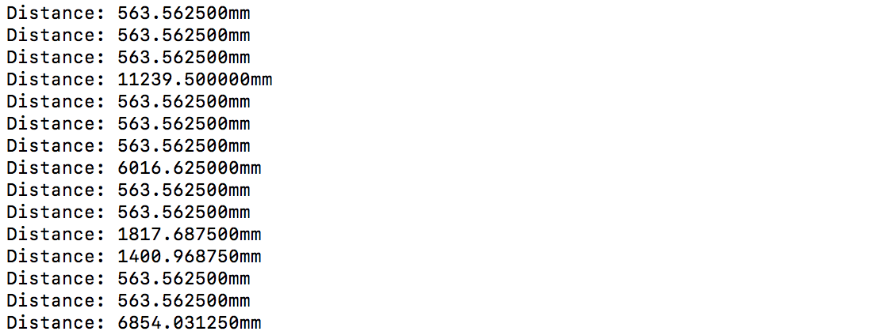

#  Skill Name: Ultrasonic Range Sensor

Author: Chen-Yu Chang

Date: 2020-10-06
-----

## Summary
1. I built a directory (ultrasonic) to put all the codes, CMakeList.txt, Makefile...
2. I altered the text of CMakeList.txt to contain the right project.
3. I wrote a thermistor.c file that are in the code folder.
4. I configured and build the project and I can successfully estimating the distance from the sensor to an object that reflects the sound. I used a formula to convert the voltage to distance and display it on the terminal(console I/O).

## Sketches and Photos

## Modules, Tools, Source Used Including Attribution
Software: Atom, GitHub, Xcode(C Language), Terminal

Hardware: Alphanumeric Display, ESP32, Wires, Ultrasonic Range Finder -- Maxbotics

## Supporting Artifacts

ADC Control:

https://docs.espressif.com/projects/esp-idf/en/latest/esp32/api-reference/peripherals/adc.html

ADC Example Code:

https://github.com/espressif/esp-idf/tree/39f090a4f1dee4e325f8109d880bf3627034d839/examples/peripherals/adc

Range Finder -- Maxbotics:

https://www.maxbotix.com/documents/HRLV-MaxSonar-EZ_Datasheet.pdf

-----

Ultrasonic Range Sensor Video

