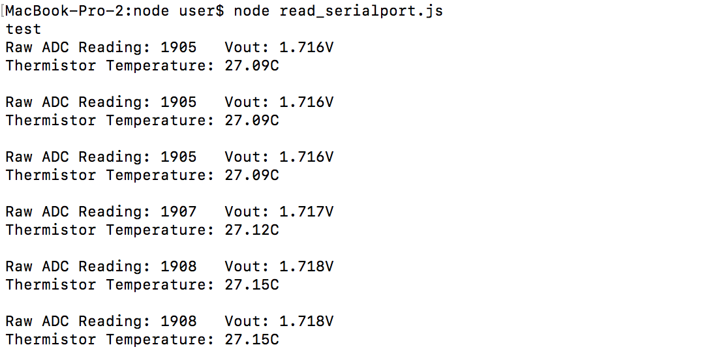

#  Skill Name: Node.js

Author: Chen-Yu Chang

Date: 2020-10-6
-----

## Summary
1. I installed node.js into my computer and followed the tutorial, learning the basic implementations of modules, events...etc.
2. I learned how to implement node.js in serialport, connecting with esp32.
3. I wrote a code of read_serialport.js for reading the sensor connected to the port(I used thermistor for this skill.).
4. The results are shown in the console I/O in the terminal.

## Sketches and Photos

## Modules, Tools, Source Used Including Attribution
Software: Atom, GitHub, Xcode(C Language), Terminal, Serialport.js

Hardware: Alphanumeric Display, ESP32, Wires, 10K Resistors, Thermistor: NTC mf52-103

## Supporting Artifacts

Tutorial of Node Js:

https://www.w3schools.com/nodejs/nodejs_modules.asp

Node Serial Port:

https://github.com/serialport/node-serialport

https://serialport.io/docs/api-serialport

https://www.ctolib.com/node-serialport.html

-----
