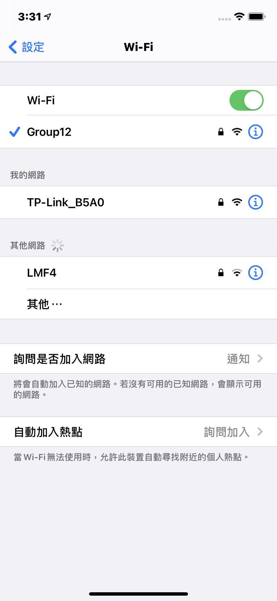
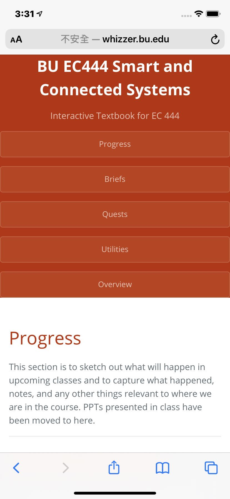

#  Skill Name: Using the Raspberri Pi as a Router

Author: Chen-Yu Chang

Date: 2020-10-14
-----

## Summary
1. I followed the instructions provided and go over all of the steps.
2. I set the ip address and password for other devices
3. I used my smartphone and connect to the Wifi called Group12, and I tried to search online using the wifi. I successfully used the Raspberri Pi as a router.

## Sketches and Photos

## Modules, Tools, Source Used Including Attribution
Raspberri Pi Zero W, Terminal, Atom

## Supporting Artifacts

Ethernet Gadget:

https://learn.adafruit.com/turning-your-raspberry-pi-zero-into-a-usb-gadget/ethernet-gadget

General Instructions:

http://whizzer.bu.edu/skills/rpi-router-v3

-----
