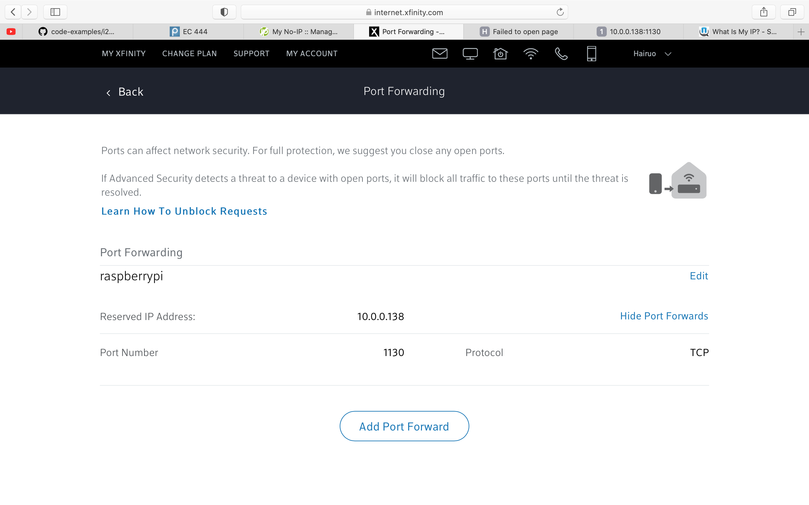

#  Skill Name: Dynamic DNS

Author: Chen-Yu Chang

Date: 2020-10-20
-----

## Summary
1. I installed ddClient on my RPI, registered a personal domain on noip.com "hrsun.ddns.net".
2. Then, I set up ddClient to dynamically update my domain IP address to match with my home router's external IP address.
3. Finally, I installed node.js on my RPI and run the "hello_world.js" on this RPI, and I successfully log onto my personal domain with the listening port specified in "hello_world.js". Images below can show you the successful ddns and port forwarding setup and correct domain output.

## Sketches and Photos

## Modules, Tools, Source Used Including Attribution
Terminal, Raspberri Pi Zero W, No ip, Local Network, ssh, ddclient

## Supporting Artifacts

DDclient:

https://domoticproject.com/accessing-raspberry-ddns/

No ip Create Domain:

https://my.noip.com/

Setting up a wireless LAN via the command line:

https://www.raspberrypi.org/documentation/configuration/wireless/wireless-cli.md

Node js Tutorial:

https://www.w3schools.com/nodejs/default.asp

-----
