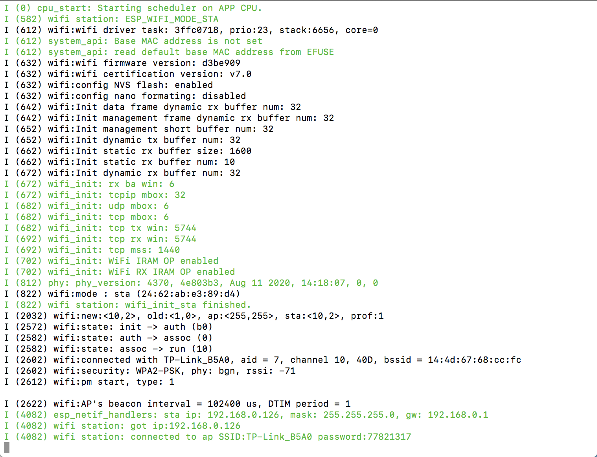

#  Skill Name: WiFi

Author: Chen-Yu Chang

Date: 2020-10-20
-----

## Summary
1. I cloned the code from the website below into my local computer.
2. I altered the ssid and password parts with my home wifi.
3. I configured and build the project and I can successfully connect my ESP32 to the wifi.

## Sketches and Photos

## Modules, Tools, Source Used Including Attribution
ESP32, Terminal, Wifi, Atom

## Supporting Artifacts

Wifi Station Example Code:

https://github.com/espressif/esp-idf/tree/master/examples/wifi/getting_started/station

-----
