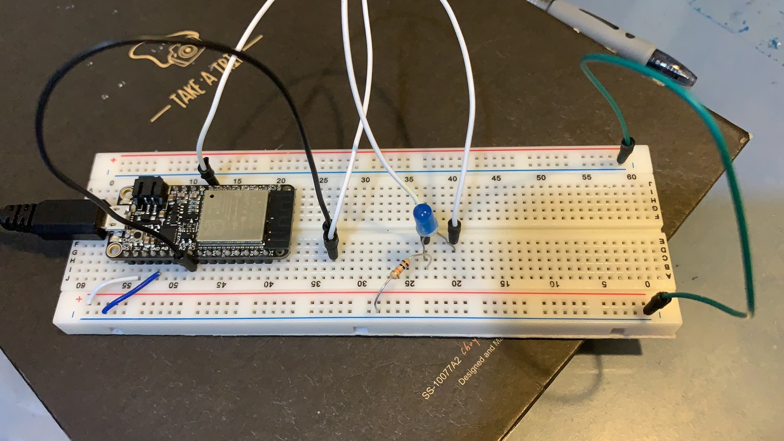

#  Skill Name: PWM to control power delivery to LEDs

Author: Chen-Yu Chang

Date: 2020-10-19
-----

## Summary
1. I built two directories for two requirements (led_input & led_cycle) to put all the codes, CMakeList.txt, Makefile.
2. I altered the text of CMakeList.txt to contain the right project.
3. I wrote led_input.c & led_cycle that are in the code folder.
4. I configured and build the project and I can successfully set the input power to the LED and cycle through each intensity level, staying each step in 250 ms.

## Sketches and Photos

## Modules, Tools, Source Used Including Attribution
LED, Resistor, ESP32, Terminal, Atom, C Language

## Supporting Artifacts

LED Control:

https://docs.espressif.com/projects/esp-idf/en/latest/esp32/api-reference/peripherals/ledc.html

MCPWM:

https://docs.espressif.com/projects/esp-idf/en/latest/esp32/api-reference/peripherals/mcpwm.html

MCPWM Example:

https://github.com/espressif/esp-idf/tree/master/examples/peripherals/mcpwm/mcpwm_servo_control

-----

LED Input Video

LED Cycle Video

