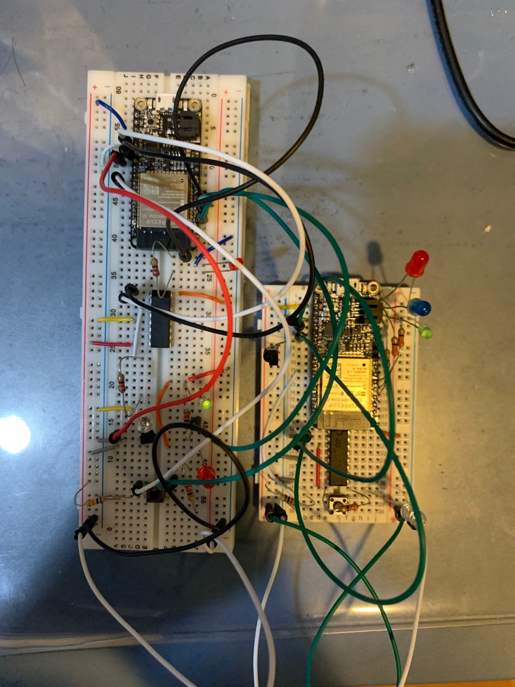

#  Skill Name: IR TX/RX

Author: Chen-Yu Chang

Date: 2020-10-29
-----

## Summary
1. I built up two identical units of an IR emitter and IR receiver.
2. I used the H-bridge to modulate UART with a 38 kHz carrier with the ESP RMT module.
3. I wrote the code so that a button click will cause one fob to send a code to the receiving fob. If received by the second fob, it will set its state to the new state and then light up the appropriate LED color.
4. Finally, I successfully finished the work and demonstrated the result in the following video.

## Sketches and Photos

## Modules, Tools, Source Used Including Attribution
ESP32, LEDs, Uart, Button, IR LED, Receiver, C Language, Atom, Terminal

## Supporting Artifacts

IR Example Code:

https://github.com/espressif/esp-idf/blob/master/examples/peripherals/uart/uart_echo/main/uart_echo_example_main.c

RMT:

https://docs.espressif.com/projects/esp-idf/en/latest/esp32/api-reference/peripherals/rmt.html

IR Communication:

http://whizzer.bu.edu/briefs/design-patterns/dp-irtxrx

-----

IR TX/RX Video

