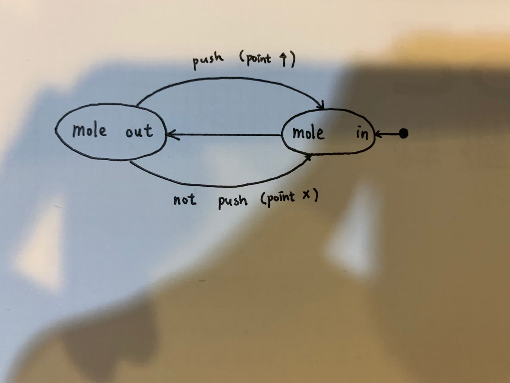
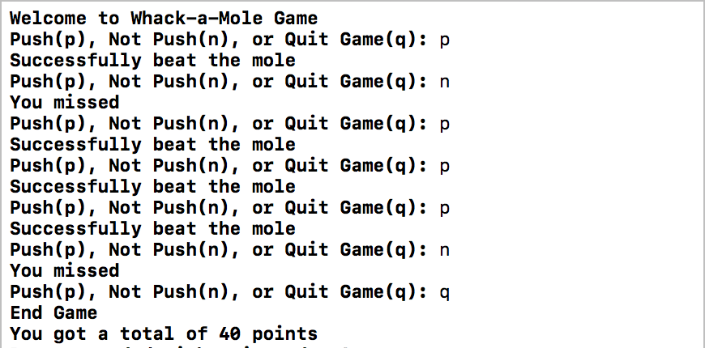

#  Skill Name: State Models

Author: Chen-Yu Chang

Date: 2020-11-05
-----

## Summary
1. I played the game to understand how the whack-a-mole game works and drew the following state diagram.
2. I implemented the state machine into the C code and the output is in the figure below.
3. The output successfully showed the procedure matching my whack-a-mole state machine and the whack-a-mole game.

## Sketches and Photos

## Modules, Tools, Source Used Including Attribution
C Language, Atom, Terminal

## Supporting Artifacts

Whack-a-Mole Game:

https://www.crazygames.com/game/whack-a-mole

Design Patterns:

http://whizzer.bu.edu/briefs/design-patterns/dp-state-machine

-----
