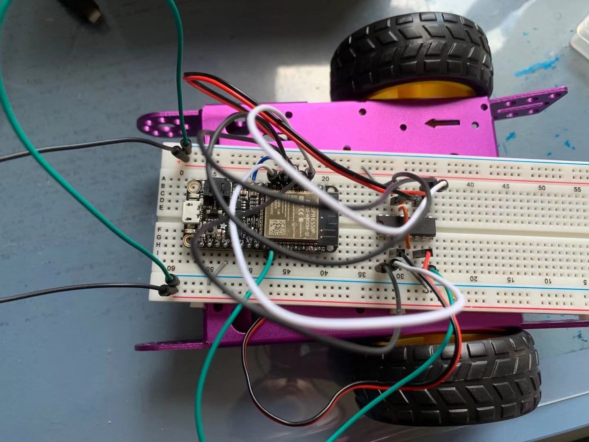
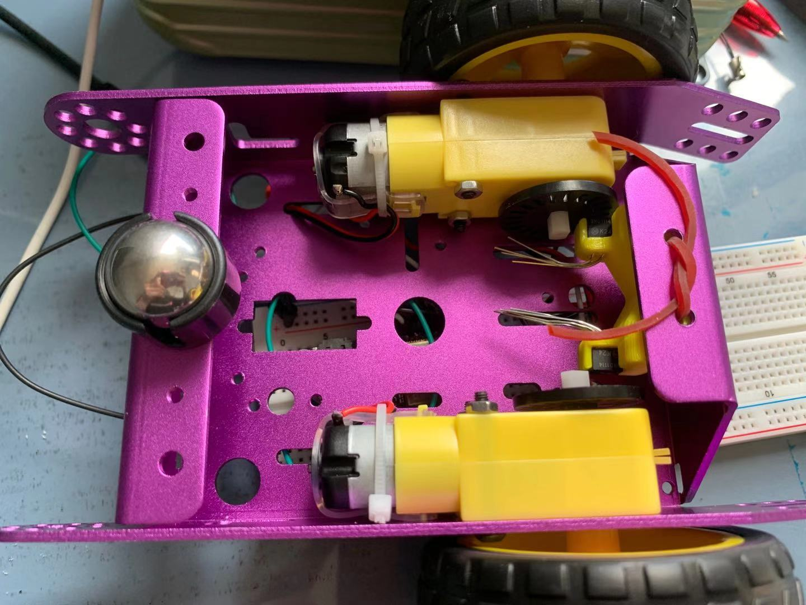

#  Skill Name: Purple Car & TT Motor

Author: Chen-Yu Chang

Date: 2020-11-19
-----

## Summary
1. I assembled the purple car with motors and wheels.
2. I wired up the circuit and connected with the purple car.
3. I wrote the c code that makes the wheel to spin forward, backward, and stop.

## Sketches and Photos

## Modules, Tools, Source Used Including Attribution

Purple Car, ESP32, C Code, L298, TT Motor, Wheels, Terminal, Atom

## Supporting Artifacts

MCPWM brushed dc motor control Example:

https://github.com/espressif/esp-idf/tree/11b444b8f493165eb4d93f44111669ee46be0327/examples/peripherals/mcpwm/mcpwm_brushed_dc_control

MCPWM:

https://docs.espressif.com/projects/esp-idf/en/latest/esp32/api-reference/peripherals/mcpwm.html

H-Bridges:

http://www.modularcircuits.com/blog/articles/h-bridge-secrets/h-bridges-the-basics/

-----
