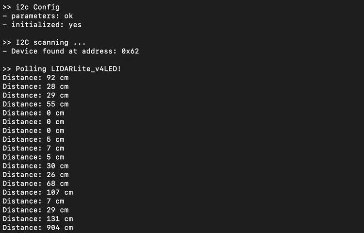

#  Skill Name: Lidar

Author: Chen-Yu Chang

Date: 2020-11-27
-----

## Summary
1. I wired up the lidar to the ESP32.
2. I wrote the c code that makes the lidar to detect the distance between the lidar to the object. Wire up power, ground, I2C SCL, I2C SDA and spend 22ms delay for boot up. It Write to register 0x00 with value 0x04 (initiates and begins acquisition) and read register 0x01, repeating to read of 0x01 until bit 0 (LSB) goes low and reading two bytes from 0x10 (low byte 0x10 then high byte 0x11) to get 16-bit distance in cm.

## Sketches and Photos

## Modules, Tools, Source Used Including Attribution

ESP32, Garmin v4 LIDAR, C Code, Terminal, Atom

## Supporting Artifacts

Lidar Datasheet:

http://static.garmin.com/pumac/LIDAR-Lite%20LED%20v4%20Instructions_EN-US.pdf

Lidar Arduino Example Code:

https://github.com/garmin/LIDARLite_Arduino_Library

-----
