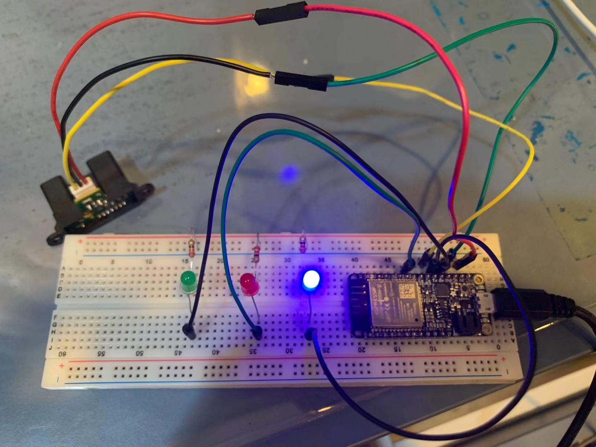
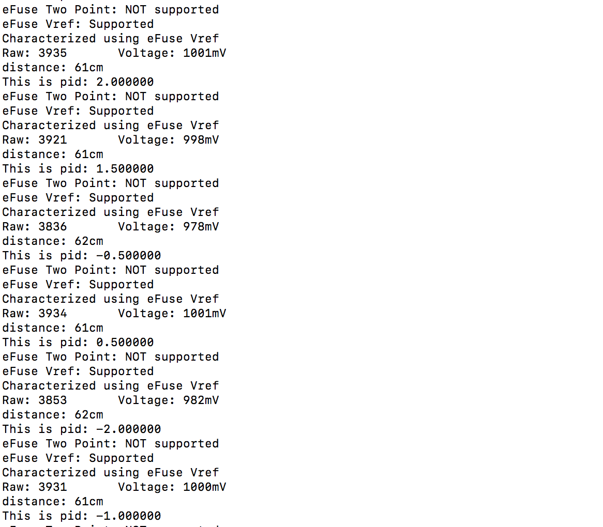

#  Skill Name: PID Control Using the Micro

Author: Chen-Yu Chang

Date: 2020-11-20
-----

## Summary
1. I connected the circuit as the following image with IR RangeFinder.
2. I wrote the code of pid that calculate the error signal of the distance between the sensor and the object.
3. I set the targeted distance to be 60cm.
4.
  If the error < 0, then turn on the red LED
  If the error = 0, then turn on the green LED
  If the error > 0, then turn on the blue LED

## Sketches and Photos

## Modules, Tools, Source Used Including Attribution

IR RangeFinder, ESP32, LEDs, C Code, Terminal, Atom

## Supporting Artifacts

PID Design Pattern:

http://whizzer.bu.edu/briefs/design-patterns/dp-pid

IR RangeFinder Code From Skill 15:

https://github.com/BU-EC444/Chang-Chen-Yu/tree/master/skills/cluster-2/15/code

Sharp IR Rangefinder:

https://www.sparkfun.com/datasheets/Sensors/Infrared/gp2y0a02yk_e.pdf

-----

PID Demo

